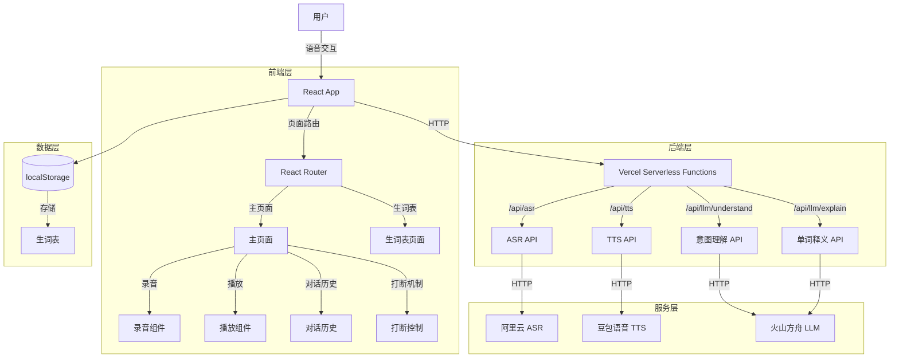
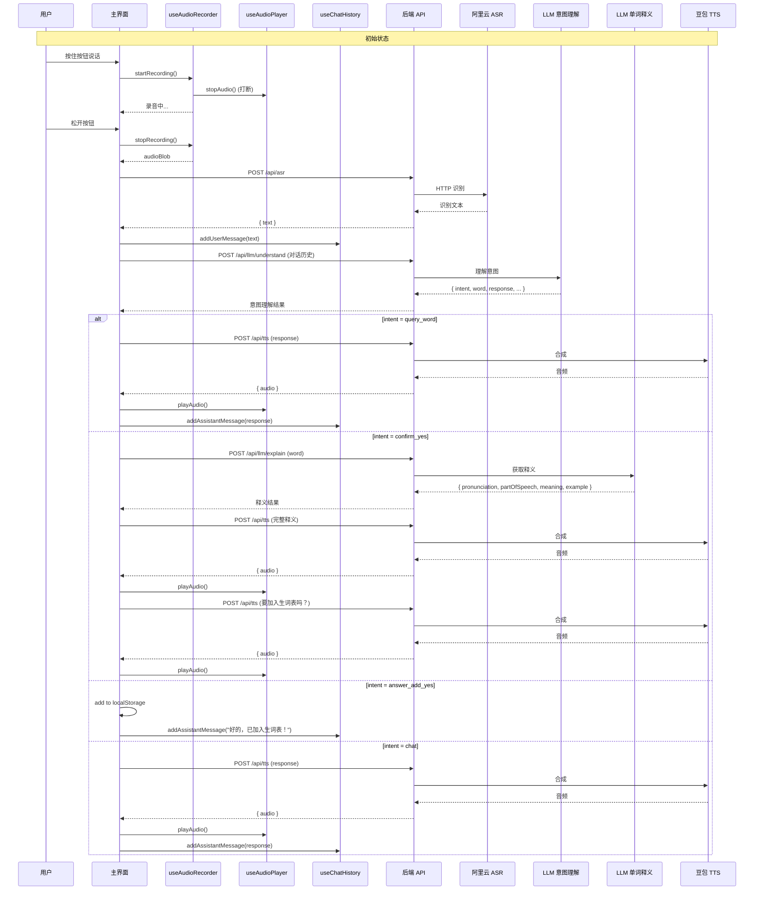

# DESIGN - 儿童语音英语查词应用（意图驱动架构）

## 整体架构



---

## 分层设计

### 1. 前端层（Pages）
- **HomePage**：主交互页面，包含录音按钮、状态显示、对话历史
- **VocabularyPage**：生词表页面，展示单词列表

### 2. 前端组件层（Components）
- **RecordButton**：大圆形录音按钮，支持打断
- **StatusDisplay**：状态文字显示
- **VocabList**：生词表列表

### 3. 前端 Hooks 层
- **useAudioRecorder**：录音 Hook，支持打断时立即停止
- **useAudioPlayer**：播放 Hook，支持打断时立即停止
- **useVocabulary**：生词表管理 Hook（localStorage）
- **useChatHistory**：对话历史管理 Hook

### 4. 后端 API 层（Vercel Serverless Functions）
- **api/asr.ts**：语音识别接口
- **api/tts.ts**：语音合成接口
- **api/llm/understand.ts**：意图理解接口
- **api/llm/explain.ts**：单词释义接口

### 5. 后端服务层（Lib）
- **lib/aliyun-asr.ts**：阿里云 ASR HTTP 封装
- **lib/volcengine-tts.ts**：豆包 TTS HTTP 封装
- **lib/ark-llm.ts**：火山方舟 LLM 封装（意图理解 + 释义）

### 6. 工具层（Utils）
- **audioConverter.ts**：音频格式转换（WebM → WAV）

---

## 模块依赖关系

```mermaid
graph LR
    App[App.tsx] --> Router[React Router]
    Router --> Home[HomePage]
    Router --> Vocab[VocabularyPage]
    
    Home --> RecordBtn[RecordButton]
    Home --> Status[StatusDisplay]
    Home --> UseChatHistory[useChatHistory]
    Home --> UseRecorder[useAudioRecorder]
    Home --> UsePlayer[useAudioPlayer]
    
    UseRecorder --> APIClient[API Client]
    UsePlayer --> APIClient
    Home --> APIClient
    
    APIClient --> ASR_API[/api/asr]
    APIClient --> TTS_API[/api/tts]
    APIClient --> LLM_UNDERSTAND[/api/llm/understand]
    APIClient --> LLM_EXPLAIN[/api/llm/explain]
    
    ASR_API --> AliyunASR[阿里云 ASR]
    TTS_API --> DoubaoTTS[豆包 TTS]
    LLM_UNDERSTAND --> ArkLLM[火山方舟 LLM]
    LLM_EXPLAIN --> ArkLLM
    
    Home --> UseVocab[useVocabulary]
    UseVocab --> LocalStorage[(localStorage)]
    
    Vocab --> VocabList[VocabList]
    Vocab --> UseVocab
```

---

## 意图驱动交互流程

### 核心概念
- **不再使用传统状态机**
- **每次用户说话，都调用 LLM 理解意图**
- **前端维护对话历史，传给 LLM 用于上下文理解**

### 交互流程图



---

## 后端 API 接口契约

### POST /api/asr
语音识别

**请求**
```typescript
{
  audio: string; // base64 encoded audio
  format: string; // webm, wav, etc.
  sampleRate: number; // 16000
}
```

**响应**
```typescript
{
  success: boolean;
  text: string;
}
```

---

### POST /api/tts
语音合成

**请求**
```typescript
{
  text: string;
  voiceType?: string;
}
```

**响应**
```typescript
{
  success: boolean;
  audio: string; // base64 encoded audio
}
```

---

### POST /api/llm/understand
意图理解

**请求**
```typescript
{
  history: Array<{
    role: 'user' | 'assistant';
    content: string;
  }>;
  currentInput: string;
}
```

**响应**
```typescript
{
  success: boolean;
  intent: 'query_word' | 'confirm_yes' | 'confirm_no' | 'add_to_vocabulary' | 'answer_add_yes' | 'answer_add_no' | 'chat' | 'unclear';
  word?: string;
  spelling?: string;
  needs_confirmation?: boolean;
  response: string;
}
```

---

### POST /api/llm/explain
获取单词释义

**请求**
```typescript
{
  word: string;
}
```

**响应**
```typescript
{
  success: boolean;
  explanation: {
    word: string;
    pronunciation: string;
    partOfSpeech: string;
    meaning: string;
    example: string;
  };
}
```

---

## 数据结构

### 对话历史（前端）
```typescript
interface ChatMessage {
  role: 'user' | 'assistant';
  content: string;
  timestamp: number;
}
```

### 意图理解结果
```typescript
interface IntentResult {
  intent: 'query_word' | 'confirm_yes' | 'confirm_no' | 'add_to_vocabulary' | 'answer_add_yes' | 'answer_add_no' | 'chat' | 'unclear';
  word?: string;
  spelling?: string;
  needs_confirmation?: boolean;
  response: string;
}
```

### 单词释义
```typescript
interface WordExplanation {
  word: string;
  pronunciation: string;
  partOfSpeech: string;
  meaning: string;
  example: string;
}
```

---

## 打断机制设计

### 实现原理
- 用户按住录音按钮时，立即停止当前音频播放
- 逻辑上视为播报已完成
- 可以随时打断

### 实现位置
- **useAudioRecorder.ts**: `startRecording()` 时调用 `useAudioPlayer.stop()`
- **RecordButton.tsx**: `onMouseDown` / `onTouchStart` 时触发

---

## 异常处理策略

### 错误类型
1. **录音权限错误**
   - 处理：提示用户授权麦克风
   - 提示语："请允许我使用你的麦克风哦"

2. **ASR 识别错误**
   - 处理：语音提示 + 屏幕显示
   - 提示语："刚才没听清，请再试一次"

3. **TTS 合成错误**
   - 处理：使用浏览器 SpeechSynthesis 作为 fallback
   - 提示语：（直接播放 fallback 语音）

4. **LLM 调用错误**
   - 处理：重试 1 次，失败则提示
   - 提示语："这个词我还不太认识，换一个试试吧"

5. **LLM 返回格式错误**
   - 处理：重试 1 次，失败则提示
   - 提示语："我有点迷糊了，请再说一遍"

6. **网络错误**
   - 处理：统一提示
   - 提示语："网络有点问题，请稍后再试"

### 重试策略
- LLM 调用（意图理解 + 释义）：自动重试 1 次
- ASR/TTS：不自动重试，提示用户重新操作

---

## 项目结构

```
ChildVoiceDictionary/
├── src/                          # 前端代码
│   ├── components/
│   │   └── RecordButton.tsx
│   ├── pages/
│   │   ├── HomePage.tsx
│   │   └── VocabularyPage.tsx
│   ├── hooks/
│   │   ├── useAudioRecorder.ts
│   │   ├── useAudioPlayer.ts
│   │   ├── useVocabulary.ts
│   │   └── useChatHistory.ts
│   ├── services/
│   │   └── api.ts
│   ├── utils/
│   │   └── audioConverter.ts
│   ├── App.tsx
│   └── main.tsx
├── api/                          # 后端代码
│   ├── asr.ts
│   ├── tts.ts
│   ├── llm/
│   │   ├── understand.ts
│   │   └── explain.ts
│   └── lib/
│       ├── aliyun-asr.ts
│       ├── volcengine-tts.ts
│       └── ark-llm.ts
├── docs/
│   └── ChildVoiceDictionary/
│       ├── ALIGNMENT_ChildVoiceDictionary.md
│       ├── CONSENSUS_ChildVoiceDictionary.md
│       ├── DESIGN_ChildVoiceDictionary.md
│       ├── TASK_ChildVoiceDictionary.md
│       └── TODO_ChildVoiceDictionary.md
├── .env.local
├── .env.example
├── vercel.json
├── package.json
└── tsconfig.json
```
