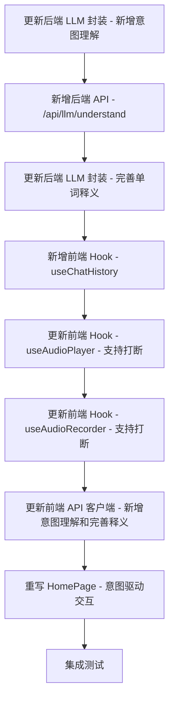

# TASK - 儿童语音英语查词应用（意图驱动架构）

## 任务依赖图

---

## 原子任务列表

### T1: 更新后端 LLM 封装 - 新增意图理解
**优先级**: 高  
**依赖**: 无  
**输入契约**:
- 现有 arkLlm.ts

**输出契约**:
- 新增 `understandIntent()` 函数
- 接收对话历史和当前输入
- 返回 IntentResult 对象

**实现约束**:
- 使用火山方舟 OpenAI 兼容接口
- 使用指定的 System Prompt（意图理解）
- 必须返回 JSON 格式
- 容错处理（LLM 返回格式错误时重试）

**验收标准**:
- [ ] understandIntent() 函数存在
- [ ] 可以调用火山方舟理解意图
- [ ] 返回符合格式的 IntentResult
- [ ] 错误处理和重试机制正确

---

### T2: 新增后端 API - /api/llm/understand
**优先级**: 高  
**依赖**: T1  
**输入契约**:
- understandIntent() 函数

**输出契约**:
- api/llm/understand.ts
- POST /api/llm/understand 接口

**实现约束**:
- Vercel Serverless Functions 格式
- 接收 history 和 currentInput
- 返回 IntentResult

**验收标准**:
- [ ] 接口可以正常调用
- [ ] 返回意图理解结果
- [ ] 错误处理正确

---

### T3: 更新后端 LLM 封装 - 完善单词释义
**优先级**: 高  
**依赖**: 无  
**输入契约**:
- 现有 arkLlm.ts

**输出契约**:
- 更新 `explainWord()` 函数
- 返回包含 pronunciation、partOfSpeech、meaning、example 的完整释义

**实现约束**:
- 使用火山方舟 OpenAI 兼容接口
- 使用指定的 System Prompt（单词释义）
- 必须返回 JSON 格式
- 容错处理

**验收标准**:
- [ ] explainWord() 返回完整释义
- [ ] 包含所有四个字段
- [ ] 格式正确

---

### T4: 新增前端 Hook - useChatHistory
**优先级**: 高  
**依赖**: 无  
**输入契约**:
- 无

**输出契约**:
- hooks/useChatHistory.ts
- addUserMessage()
- addAssistantMessage()
- getHistory()
- clearHistory()

**实现约束**:
- 使用 useState 管理
- ChatMessage 类型定义
- 保留最近 N 条消息（避免太长）

**验收标准**:
- [ ] 可以添加用户消息
- [ ] 可以添加助手消息
- [ ] 可以获取完整历史
- [ ] 可以清空历史

---

### T5: 更新前端 Hook - useAudioPlayer - 支持打断
**优先级**: 高  
**依赖**: 无  
**输入契约**:
- 现有 useAudioPlayer.ts

**输出契约**:
- 更新 stopAudio() 函数
- 确保停止立即生效

**实现约束**:
- 使用 HTML5 Audio API
- 立即停止播放
- 重置播放状态

**验收标准**:
- [ ] stopAudio() 可以立即停止
- [ ] 播放状态正确更新

---

### T6: 更新前端 Hook - useAudioRecorder - 支持打断
**优先级**: 高  
**依赖**: T5  
**输入契约**:
- 现有 useAudioRecorder.ts
- useAudioPlayer Hook

**输出契约**:
- 更新 startRecording() 函数
- 开始录音时自动调用 useAudioPlayer.stopAudio()

**实现约束**:
- startRecording() 时停止播放
- 打断机制生效

**验收标准**:
- [ ] 按下录音按钮时立即停止播报
- [ ] 打断机制正常工作

---

### T7: 更新前端 API 客户端 - 新增意图理解和完善释义
**优先级**: 高  
**依赖**: 无  
**输入契约**:
- 现有 services/api.ts

**输出契约**:
- 新增 understandIntent() 方法
- 更新 explainWord() 方法（返回完整释义）

**实现约束**:
- TypeScript 类型定义
- 错误处理
- fetch/axios 调用

**验收标准**:
- [ ] understandIntent() 方法正确
- [ ] explainWord() 返回完整释义
- [ ] 类型定义正确

---

### T8: 重写 HomePage - 意图驱动交互
**优先级**: 最高  
**依赖**: T4, T5, T6, T7  
**输入契约**:
- useChatHistory Hook
- useAudioRecorder Hook
- useAudioPlayer Hook
- API 客户端

**输出契约**:
- 重写 HomePage.tsx
- 意图驱动的交互逻辑
- 不再使用状态机

**实现约束**:
- 每次用户说话后：
  1. ASR 识别
  2. 调用 LLM 理解意图
  3. 根据 intent 执行相应操作
- 支持打断
- 错误处理完善

**验收标准**:
- [ ] 完整意图驱动流程可以正常执行
- [ ] query_word 意图正常
- [ ] confirm_yes/confirm_no 意图正常
- [ ] answer_add_yes/answer_add_no 意图正常
- [ ] chat 意图正常
- [ ] 打断机制正常工作
- [ ] 完整释义（读音+词性+含义+举例）正常播报

---

### T9: 集成测试
**优先级**: 高  
**依赖**: T8  
**输入契约**:
- 完整项目

**输出契约**:
- 完整功能验证
- 文档更新

**实现约束**:
- 手动测试完整流程

**验收标准**:
- [ ] 完整意图驱动流程测试通过
- [ ] 各种意图都能正确识别
- [ ] 打断机制测试通过
- [ ] 完整释义测试通过
- [ ] 生词表功能测试通过
- [ ] 所有错误处理测试通过
- [ ] 项目可以正常构建
