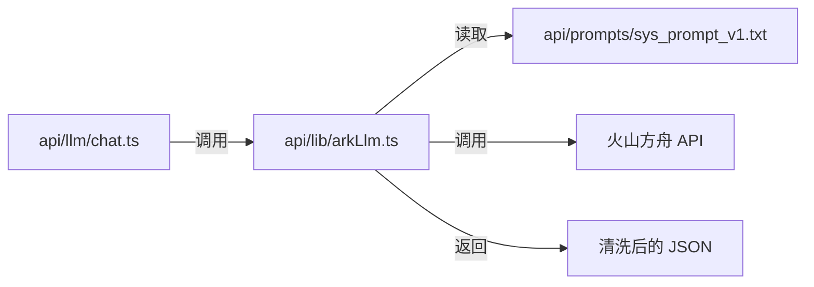
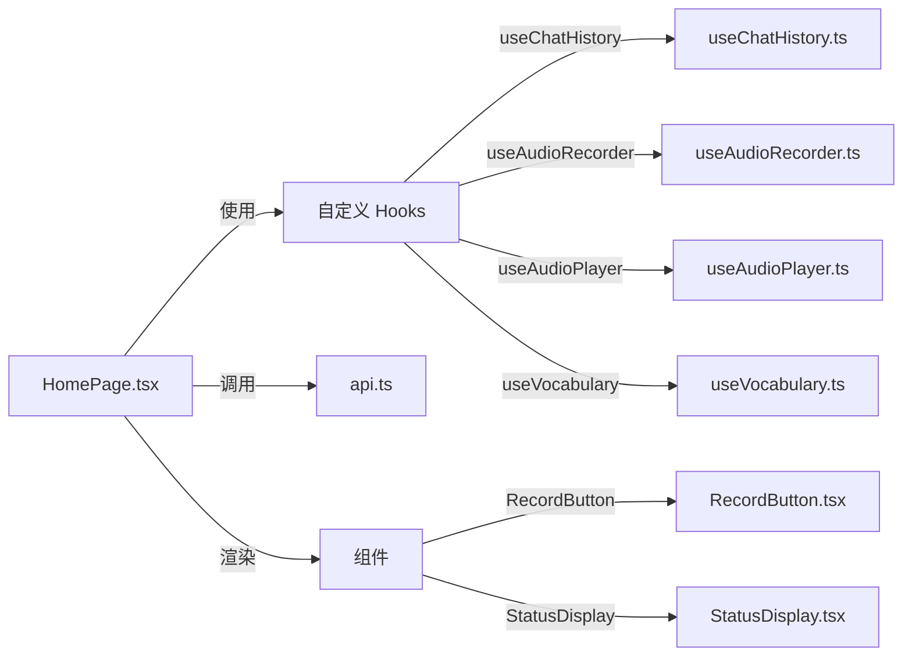
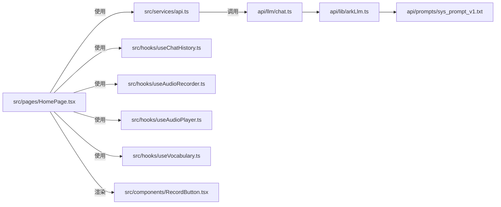
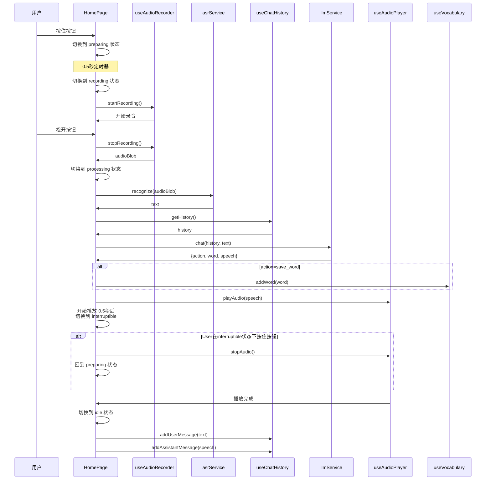
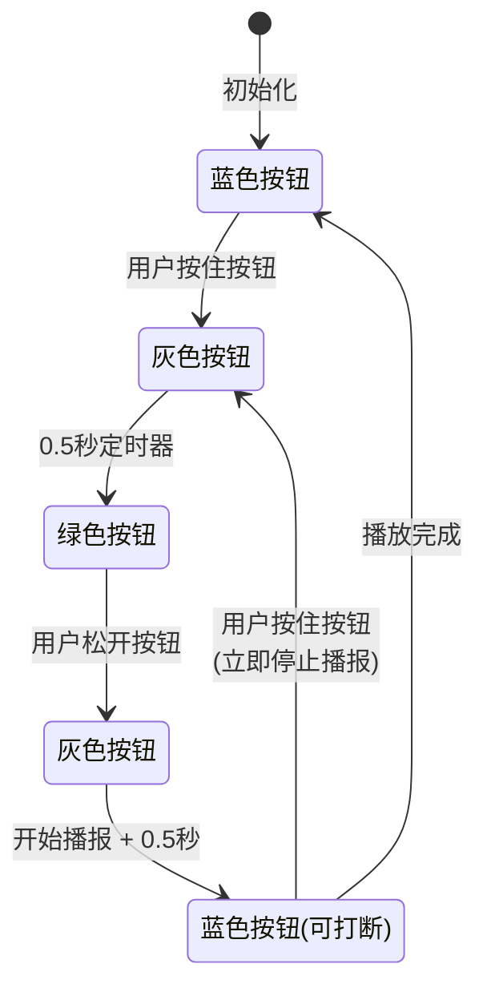

# DESIGN - 对话交互逻辑重构

## 整体架构图

```mermaid
graph TD
    User[用户] -->|按住说话| HomePage[HomePage]
    HomePage -->|录音| useAudioRecorder[useAudioRecorder]
    useAudioRecorder -->|audioBlob| HomePage
    HomePage -->|调用| ASR[asrService.recognize]
    ASR -->|text| HomePage
    HomePage -->|获取| useChatHistory[useChatHistory]
    useChatHistory -->|history| HomePage
    HomePage -->|调用| LLM[llmService.chat]
    LLM -->|{action, word, speech}| HomePage
    HomePage -->|action=save_word| useVocabulary[useVocabulary.addWord]
    HomePage -->|speech| useAudioPlayer[useAudioPlayer.playAudio]
    HomePage -->|更新| useChatHistory
    HomePage -->|渲染| UI[UI 组件]
    UI -->|按钮颜色| ButtonStateMachine[按钮状态机]
```

---

## 分层设计和核心组件

### 后端分层



**核心后端组件**：
1. `api/llm/chat.ts`：新的 Serverless Function
2. `api/lib/arkLlm.ts`：更新后的 LLM 库，新增 `chat` 方法
3. `api/prompts/sys_prompt_v1.txt`：系统提示词文件

### 前端分层



**核心前端组件**：
1. `HomePage.tsx`：重写的主页面
2. `api.ts`：更新的 API 服务
3. `useChatHistory.ts`：支持 localStorage 持久化
4. `RecordButton.tsx`：更新的按钮组件，支持新的颜色状态
5. 按钮状态机：在 HomePage 内部实现

---

## 模块依赖关系图



---

## 接口契约定义

### 后端接口：POST /api/llm/chat

**请求**：
```typescript
{
  history: Array<{
    role: 'user' | 'assistant';
    content: string;
  }>;
  currentInput: string;
}
```

**响应**：
```typescript
{
  action: 'confirm_word' | 'explain_word' | 'ask_spell' | 'ask_save' | 'save_word' | 'skip_save' | 'chat';
  word?: string;
  speech: string;
}
```

---

## 数据流向图

### 完整交互流程



---

## 按钮状态机

### 状态定义

| 状态 | 颜色 | 说明 |
|------|------|------|
| `idle` | 蓝色 | 空闲，等待用户输入 |
| `preparing` | 灰色 | 按住后，准备录音中（0.5秒） |
| `recording` | 绿色 | 正在录音 |
| `processing` | 灰色 | 松手后，处理中、等待响应、播报前 |
| `interruptible` | 蓝色 | 播报中，可打断 |

### 状态转换图



---

## 异常处理策略

### LLM JSON 解析异常

```typescript
function cleanAndParseLLMResponse(rawText: string): LLMChatResponse {
  // 1. 清洗 markdown 代码块标记
  let cleaned = rawText
    .replace(/^```json\s*/, '')
    .replace(/```$/, '')
    .trim();

  try {
    return JSON.parse(cleaned);
  } catch (e) {
    // 2. 兜底策略
    return {
      action: 'chat',
      speech: cleaned,
    };
  }
}
```

### 对话历史裁剪策略

```typescript
function trimHistory(history: HistoryMessage[]): HistoryMessage[] {
  const MAX_HISTORY = 15;
  if (history.length <= MAX_HISTORY) {
    return history;
  }
  // 保留最近 15 轮
  return history.slice(-MAX_HISTORY);
}
```
