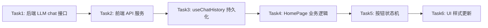

# TASK - 对话交互逻辑重构

## 任务依赖图

---

## 原子任务列表

---

### Task 1: 后端 LLM chat 接口
**ID**: backend-llm-chat
**优先级**: high
**依赖**: 无
**输入契约**:
- 前置依赖: `api/prompts/sys_prompt_v1.txt` 文件存在
- 输入数据: history（对话历史数组）、currentInput（当前用户输入）
- 环境依赖: 火山方舟 API 密钥配置

**输出契约**:
- 输出数据: `{ action, word, speech }`
- 交付物: `api/llm/chat.ts`、`api/lib/arkLlm.ts`（更新）
- 验收标准:
  1. 正确读取 `sys_prompt_v1.txt`
  2. 正确裁剪对话历史到最近 15 轮
  3. 正确清洗和解析 LLM 返回的 JSON
  4. 解析失败时有兜底策略
  5. 返回格式正确

**实现约束**:
- 技术栈: Node.js + Express
- 接口规范: RESTful API
- 质量要求: 健壮的错误处理

---

### Task 2: 前端 API 服务
**ID**: frontend-api-service
**优先级**: high
**依赖**: Task 1
**输入契约**:
- 前置依赖: 后端 `/api/llm/chat` 接口可用
- 输入数据: history、currentInput

**输出契约**:
- 输出数据: `{ action, word, speech }`
- 交付物: `src/services/api.ts`（更新）
- 验收标准:
  1. 新增 `llmService.chat()` 方法
  2. 正确调用后端接口

**实现约束**:
- 技术栈: TypeScript + React
- 接口规范: 与现有 api.ts 风格一致

---

### Task 3: useChatHistory 持久化
**ID**: use-chat-history-persist
**优先级**: high
**依赖**: Task 2
**输入契约**:
- 前置依赖: 无

**输出契约**:
- 输出数据: history（从 localStorage 读取）
- 交付物: `src/hooks/useChatHistory.ts`（更新）
- 验收标准:
  1. 对话历史持久化到 localStorage
  2. 刷新页面不丢失
  3. 支持添加 user/assistant 消息

**实现约束**:
- 技术栈: TypeScript + React Hooks
- 质量要求: 与现有 hooks 风格一致

---

### Task 4: HomePage 业务逻辑
**ID**: homepage-business-logic
**优先级**: high
**依赖**: Task 3
**输入契约**:
- 前置依赖: Task 1-3 完成
- 输入数据: 用户语音输入

**输出契约**:
- 输出数据: 完整交互流程
- 交付物: `src/pages/HomePage.tsx`（重写）
- 验收标准:
  1. 单次 LLM 调用完成完整交互
  2. `action=save_word` 时正确加入生词表
  3. 正确更新对话历史
  4. 正确播报 speech

**实现约束**:
- 技术栈: TypeScript + React
- 质量要求: 代码清晰，符合现有风格

---

### Task 5: 按钮状态机
**ID**: button-state-machine
**优先级**: high
**依赖**: Task 4
**输入契约**:
- 前置依赖: Task 4 完成

**输出契约**:
- 输出数据: 按钮颜色状态
- 交付物: `src/pages/HomePage.tsx`（更新）、`src/components/RecordButton.tsx`（更新）
- 验收标准:
  1. 5 个状态正确切换
  2. 0.5 秒定时器正确
  3. 打断逻辑正确
  4. LLM action 不影响按钮颜色

**实现约束**:
- 技术栈: TypeScript + React
- 质量要求: 状态转换清晰，无竞态条件

---

### Task 6: UI 样式更新
**ID**: ui-style-update
**优先级**: medium
**依赖**: Task 5
**输入契约**:
- 前置依赖: Task 5 完成

**输出契约**:
- 输出数据: 新的 UI 布局
- 交付物: `src/pages/HomePage.css`（更新）、`src/components/RecordButton.css`（更新）
- 验收标准:
  1. 右上角生词表按钮（线框图标）
  2. 中间"语音英汉词典"标题
  3. 中间大大的圆形按钮（麦克风图标）
  4. 下方 debug 区域（可选）
  5. 按钮颜色正确

**实现约束**:
- 技术栈: 原生 CSS
- 质量要求: 蓝白配色，简洁美观
