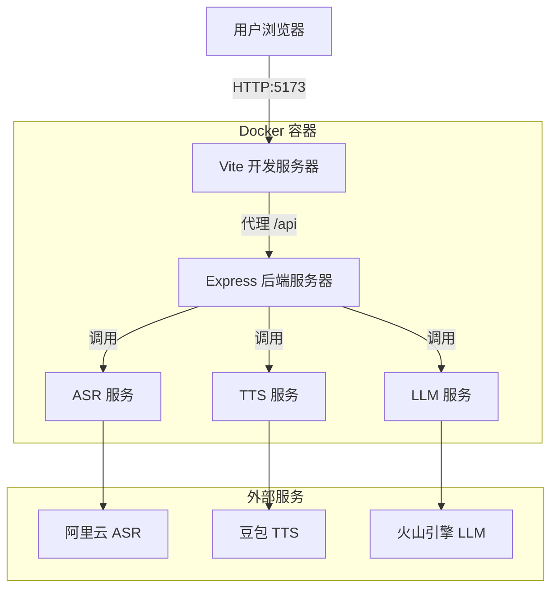
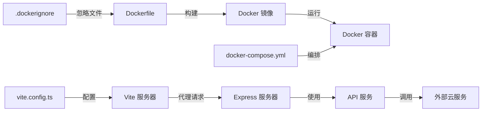
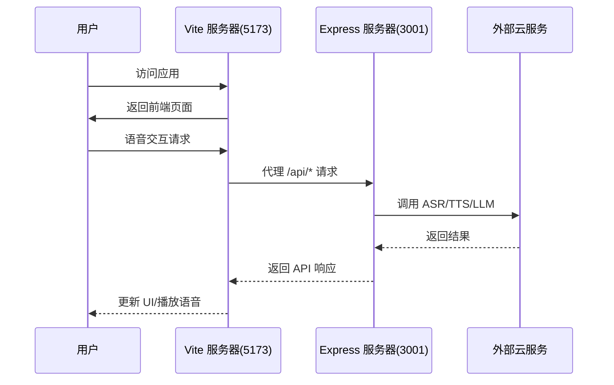

# Docker 部署 - 架构设计文档

## 整体架构图

## 分层设计和核心组件

### 1. Docker 层
- **基础镜像**：`node:20-slim`
- **工作目录**：`/app`
- **端口暴露**：5173（前端）、3001（后端）

### 2. 应用层
- **前端**：Vite 开发服务器（端口 5173）
- **后端**：Express 服务器（端口 3001）
- **进程管理**：`concurrently` 同时启动前后端

### 3. 配置层
- **环境变量**：通过 `.env.local` 挂载
- **网络配置**：Vite 监听 `0.0.0.0`，允许外部访问

## 模块依赖关系图

## 接口契约定义

### Docker 容器接口
- **端口映射**：
  - 宿主 5173 → 容器 5173（前端）
  - 宿主 3001 → 容器 3001（后端）
- **卷挂载**：
  - `./.env.local:/app/.env.local:ro`（只读挂载环境变量）

### 内部服务接口
- **前端 → 后端**：`http://localhost:3001/api/*`（通过 Vite 代理）
- **后端 → 外部服务**：直接调用各云服务 API

## 数据流向图

## 异常处理策略

### 1. 容器启动失败
- **策略**：`docker-compose.yml` 中配置 `restart: unless-stopped`
- **处理**：自动重启容器

### 2. 服务崩溃
- **策略**：`concurrently` 管理多进程，单个进程崩溃不影响其他
- **处理**：依赖进程间隔离

### 3. 环境变量缺失
- **策略**：代码中进行环境变量校验
- **处理**：返回明确的错误信息

## 安全策略

### 1. 敏感信息管理
- **策略**：`.env.local` 不打包进镜像，通过卷挂载
- **处理**：只读挂载，防止容器内修改

### 2. 网络安全
- **策略**：只暴露必要端口（5173、3001）
- **处理**：通过服务器防火墙进一步限制访问
