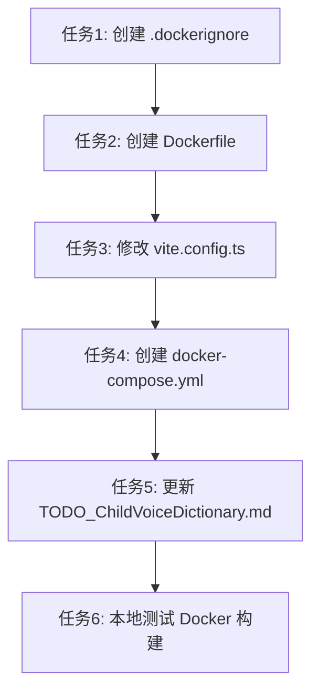

# Docker 部署 - 任务拆分文档

## 任务依赖图

## 原子任务列表

### 任务1: 创建 .dockerignore
- **输入契约**：
  - 前置依赖：无
  - 输入数据：项目根目录
  - 环境依赖：无
- **输出契约**：
  - 输出文件：`.dockerignore`
  - 交付物：Docker 构建忽略文件配置
  - 验收标准：包含 node_modules、.git、.env.local 等
- **实现约束**：
  - 技术栈：纯文本配置
  - 接口规范：标准 Dockerignore 格式
  - 质量要求：简洁、覆盖所有不必要文件
- **依赖关系**：
  - 后置任务：任务2

### 任务2: 创建 Dockerfile
- **输入契约**：
  - 前置依赖：任务1 完成
  - 输入数据：package.json、项目结构
  - 环境依赖：Node.js 20+
- **输出契约**：
  - 输出文件：`Dockerfile`
  - 交付物：Docker 镜像构建文件
  - 验收标准：可以成功构建镜像
- **实现约束**：
  - 技术栈：Dockerfile
  - 接口规范：标准 Dockerfile 格式
  - 质量要求：多阶段构建（可选，当前版本用单阶段）
- **依赖关系**：
  - 前置任务：任务1
  - 后置任务：任务3

### 任务3: 修改 vite.config.ts
- **输入契约**：
  - 前置依赖：任务2 完成
  - 输入数据：现有 vite.config.ts
  - 环境依赖：无
- **输出契约**：
  - 输出文件：修改后的 `vite.config.ts`
  - 交付物：支持 Docker 环境的 Vite 配置
  - 验收标准：添加 `host: '0.0.0.0'` 和 `port: 5173`
- **实现约束**：
  - 技术栈：TypeScript、Vite 配置
  - 接口规范：Vite 配置格式
  - 质量要求：不破坏现有配置
- **依赖关系**：
  - 前置任务：任务2
  - 后置任务：任务4

### 任务4: 创建 docker-compose.yml
- **输入契约**：
  - 前置依赖：任务3 完成
  - 输入数据：Dockerfile、端口配置
  - 环境依赖：Docker、Docker Compose
- **输出契约**：
  - 输出文件：`docker-compose.yml`
  - 交付物：容器编排配置
  - 验收标准：可以用 docker-compose up -d 启动
- **实现约束**：
  - 技术栈：Docker Compose
  - 接口规范：Docker Compose v3.8 格式
  - 质量要求：包含端口映射、卷挂载、重启策略
- **依赖关系**：
  - 前置任务：任务3
  - 后置任务：任务5

### 任务5: 更新 TODO_ChildVoiceDictionary.md
- **输入契约**：
  - 前置依赖：任务4 完成
  - 输入数据：现有 TODO_ChildVoiceDictionary.md
  - 环境依赖：无
- **输出契约**：
  - 输出文件：更新后的 `docs/ChildVoiceDictionary/TODO_ChildVoiceDictionary.md`
  - 交付物：添加后续优化 TODO 项
  - 验收标准：包含生产构建、Nginx、HTTPS 等优化项
- **实现约束**：
  - 技术栈：Markdown
  - 接口规范：现有 TODO 文档格式
  - 质量要求：清晰、优先级明确
- **依赖关系**：
  - 前置任务：任务4
  - 后置任务：任务6

### 任务6: 本地测试 Docker 构建
- **输入契约**：
  - 前置依赖：任务5 完成
  - 输入数据：所有 Docker 配置文件
  - 环境依赖：Docker、Docker Compose、.env.local
- **输出契约**：
  - 交付物：本地 Docker 测试验证报告
  - 验收标准：
    - docker-compose build 成功
    - docker-compose up -d 成功启动
    - 可以访问 http://localhost:5173
- **实现约束**：
  - 技术栈：Docker、Docker Compose
  - 质量要求：完整的端到端测试
- **依赖关系**：
  - 前置任务：任务5
  - 后置任务：无（最终任务）
